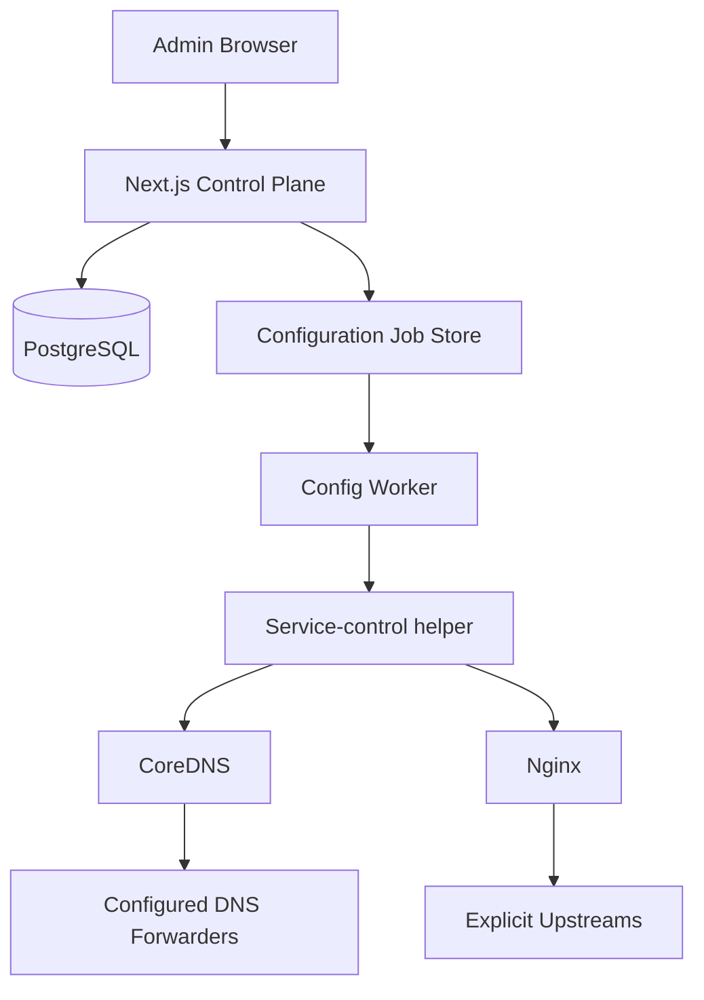
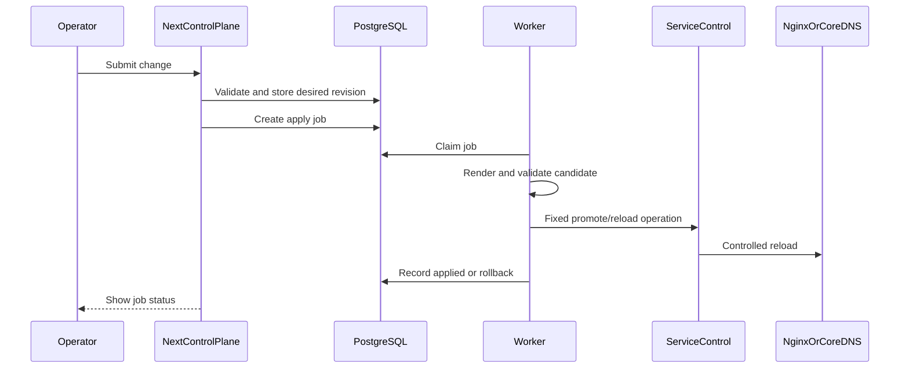

# ProxyCore Architecture

ProxyCore is a small control plane over an explicit data plane. The web app stores and validates intent; a worker renders and applies service configuration; CoreDNS and Nginx handle traffic.

## Architectural outcome

Docker Compose on one Linux host:

- Next.js + Tailwind — admin UI and control-plane API
- PostgreSQL + Drizzle — desired state, users, jobs, audit
- Worker — render, validate, apply, health-check
- Service-control helper — private Unix-socket adapter for fixed Nginx/CoreDNS operations
- CoreDNS — authoritative managed zones + forward unmanaged queries
- Nginx — HTTP/HTTPS for **proxied** DNS records (HTTP/2, optional HTTP/3) and separate TCP/UDP streams

HTTP/HTTPS proxy is Cloudflare-style: toggled on A/AAAA/CNAME records; Nginx config is derived from those records. The deployment has one installation scope. No high availability, public DNS authority, Docker discovery, OIDC, or dual control sidecars in the MVP.

## Component map

## Control plane

### Next.js

Owns: local auth/sessions, Owner/Operator roles, resource CRUD/validation, desired revisions, job submission, certificate requests, audit, status UI.

MUST NOT: hold Docker socket, run arbitrary shell, write active Nginx/CoreDNS config, expose private keys, mark jobs applied without worker evidence.

### PostgreSQL

Durable source of truth on the internal Compose network only.

### Secrets

Master key outside PostgreSQL. Certificate private keys and provider credentials encrypted at rest. Plaintext never in API responses, ordinary logs, or non-secret rendered config.

### Worker

Separate process that:

1. claims a job;
2. loads a consistent snapshot;
3. renders a versioned candidate;
4. validates (CoreDNS start/`dig`, `nginx -t` + representative checks);
5. writes candidates to constrained shared volumes and calls the service-control helper through its private Unix socket;
6. promotes and reloads through fixed helper operations;
7. health-checks and records applied state or rolls back.

The web process and worker have no raw Docker socket. Dual per-service control sidecars are deferred. The helper is the only component that may use the host/container control mechanism, and it exposes only fixed staging, validation, promotion, reload, health, and rollback operations for the named CoreDNS and Nginx services. User input cannot become shell commands or raw Nginx directives.

## Data plane

### CoreDNS (sole homelab DNS)

- One RFC 1035 zone file + `file` block per managed zone
- Root server block: `forward`, `cache`, `errors`, `health`, `ready`, `loop`, `reload`
- Default resolver pool + optional suffix rules (most-specific wins)
- Managed zones always win over forwarding
- Forwarder endpoints are DNS IP:port only (may be Pi-hole/AdGuard/public); no policy mirroring
- **Proxied A/AAAA/CNAME:** zone data answers with installation proxy ingress address(es), not the origin
- **DNS-only records:** answers use the configured record value

Candidate validation: start pinned CoreDNS on an isolated port (e.g. 1053), check readiness and representative queries (including proxied vs DNS-only answers), then promote. The control helper promotes the Corefile through the Docker API, synchronizes zone files through its private shared volume, and performs a controlled CoreDNS restart so changed zone contents are loaded deterministically.

### Nginx (derived from proxied records)

- HTTP/HTTPS reverse proxy generated from proxied A/AAAA/CNAME proxy settings
- Typed exact/prefix path routing and redirects, headers, WebSocket, Basic Auth (TLS only)
- HTTP/2 configurable; HTTP/3/QUIC configurable only when the binary exposes `ngx_http_v3_module` and both TCP/443 and UDP/443 are published
- HTTPS on by default; can be disabled per proxied record
- TCP/UDP stream proxy as separate resources (not the DNS proxy toggle)
- Official `nginx:1.30.4-alpine-slim` digest-pinned; stream capability required. The worker must verify HTTP/3 support with the selected binary before enabling QUIC.

Apply path: render candidate from proxied records → `nginx -t` → controlled reload → health checks → rollback on failure.

### Origins / upstreams

Literal IPv4/IPv6 + port + protocol. No hostname upstreams. No address-class rejection. For proxied A/AAAA, default origin IP is the record address. For proxied CNAME, origin IP:port is explicit in proxy settings. Client-facing certificates are separate from backend TLS; backend verification is an explicit per-record setting and is off by default for homelab origins.

### Proxy ingress addresses

Installation-level IPv4/IPv6 values that CoreDNS returns for proxied names. They must reach ProxyCore’s Nginx listener (LAN IP or intended ingress). This is the homelab analogue of Cloudflare edge addresses.

## Configuration lifecycle

## Observability

Structured logs + in-app health/job/certificate status. Operational logs, audit events, apply-job output, and rendered artifacts use configurable retention with a default maximum age of 7 days or maximum size of 50 MB; cleanup runs when either limit is reached. Current desired/applied state and active certificates are retained. No Prometheus endpoint and no webhook alert system in MVP.

## Compose topology (conceptual)

| Service | Exposure | Privilege |
| --- | --- | --- |
| `web` | Internal (optionally via Nginx) | No reload / no Docker socket |
| `worker` | Internal | Candidate rendering/validation; private helper socket only |
| `control` | Internal | Fixed service-control operations; private Unix socket |
| `postgres` | Internal | DB credentials |
| `nginx` | Host HTTP/HTTPS/stream ports; TCP/UDP 443 when HTTP/3 is enabled | Data plane only |
| `coredns` | LAN DNS port as configured | Data plane only |

## External boundaries

- **Let's Encrypt:** HTTP-01 and DNS-01 (Cloudflare `_acme-challenge` only); plus self-signed for internal
- **Cloudflare Tunnel:** external; trusted proxy CIDRs/headers only when explicitly configured
- **OIDC:** deferred

## Failure domains

| Failure | Behavior |
| --- | --- |
| Web down | Data plane keeps serving |
| Worker down | Desired changes unapplied; data plane unchanged |
| Postgres down | Data plane keeps last config; new changes fail visibly |
| Validation failure | Prior revision stays active |
| Reload/health failure | Rollback or explicit recovery |
| Forwarder down | Managed zones still work; unmanaged queries error visibly |
| Cert renewal failure | Current cert stays active |

## Non-goals

Public nameserver duty, host firewall/NAT/fail2ban, Docker inventory, Tunnel lifecycle, OIDC/MFA, dual sidecars, HA, multi-tenant isolation.

## Open before implementation

1. Cleanup scheduler and storage placement for the configured retention policy.
