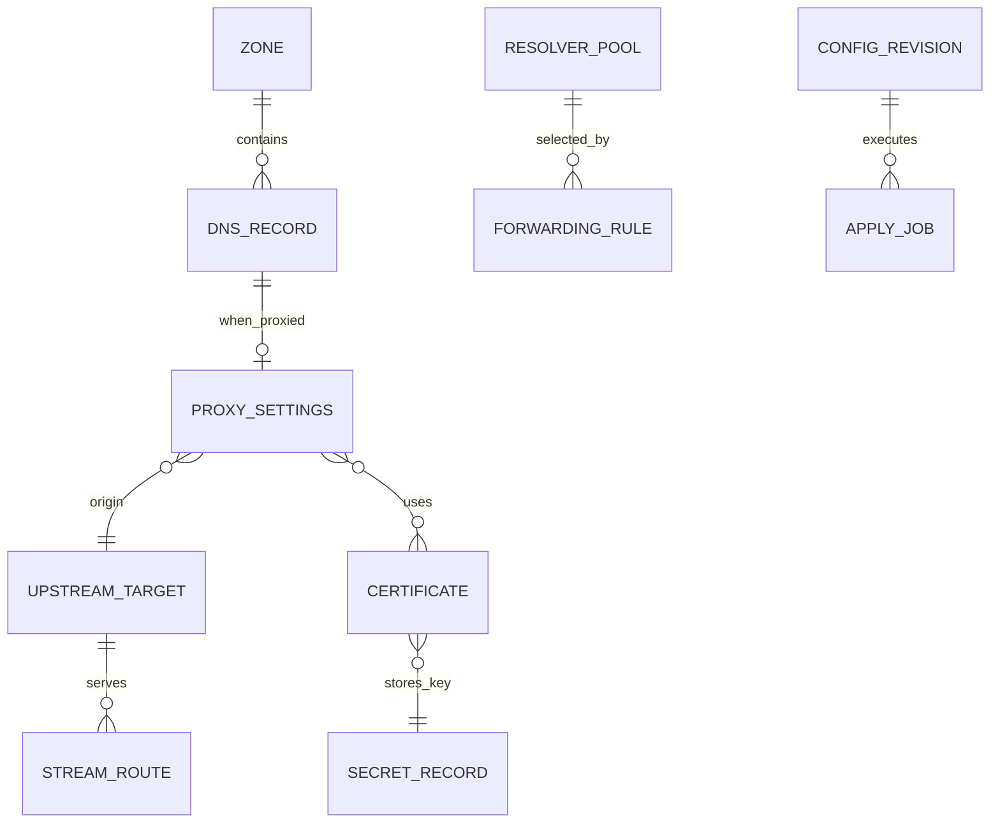
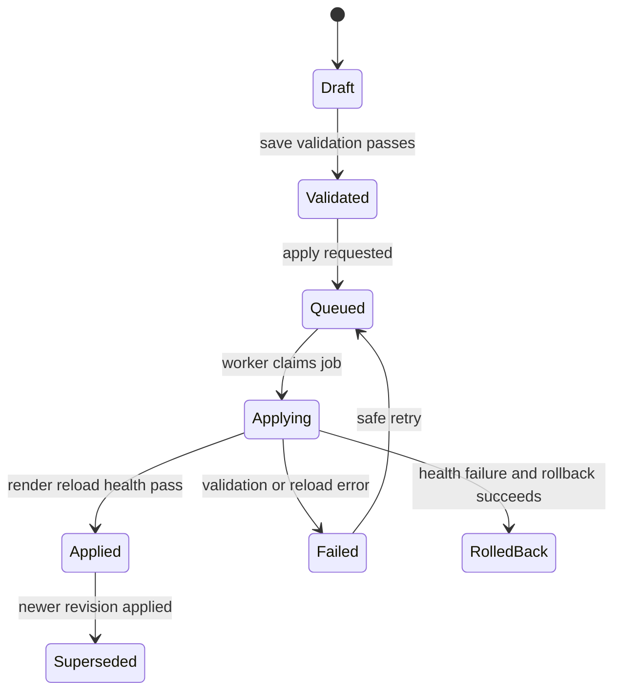

# ProxyCore Domain Model

Desired configuration and operational history live in PostgreSQL. CoreDNS and Nginx are applied targets.

## Principles

1. Mutations create desired revisions; applied history is not silently rewritten.
2. Applied state is recorded only after render → validate → reload → health.
3. Secrets are referenced, never embedded in ordinary objects.
4. One installation in the MVP; there is no Workspace/Membership tenant abstraction.
5. Provider-specific behavior stays behind adapters.
6. HTTP/HTTPS proxy is Cloudflare-style: toggled on DNS records, not as a separate top-level product entity.

## Core concepts

| Concept | Purpose |
| --- | --- |
| Installation settings | Singleton configuration for proxy ingress, DNS forwarding, and global runtime policy |
| User | Local identity with an Owner or Operator role |
| Zone | Managed DNS namespace |
| DNS record | Typed record; A/AAAA/CNAME may be proxied |
| Proxy settings | Origin/upstream and Nginx policy attached to a proxied A/AAAA/CNAME |
| Resolver pool | Ordered upstream DNS endpoints for forwarding |
| Forwarding rule | Optional suffix → resolver pool |
| Upstream target | Explicit backend IP/port/protocol used by proxy settings or streams |
| Stream route | TCP/UDP listener → upstream (separate from DNS proxy toggle) |
| Certificate | Self-signed or ACME lifecycle metadata + key reference |
| Secret record | Encrypted credential or private key |
| Provider connection | Cloudflare DNS-01 credentials (MVP) |
| Config revision | Immutable snapshot |
| Apply job | Worker execution record |
| Audit event | Who did what |

## Relationships

Installation settings are singleton records rather than a tenant entity. They hold the proxy ingress addresses and the default/suffix forwarding configuration.

## Entity notes

### User and roles

Local username/password only in MVP. Each user has one role: Owner or Operator. External identities, memberships, and MFA are deferred.

### Zone / DNS record

Internal zones. MVP types: A, AAAA, CNAME, TXT, MX, SRV. Wildcards derived from owner labels. TTL default 300 (30–86400). Reverse/PTR/NS/CAA/DNSSEC deferred.

#### Cloudflare-style proxy flag

| Record type | May be proxied |
| --- | --- |
| A, AAAA, CNAME | Yes — explicit `proxied` toggle |
| TXT, MX, SRV | No — DNS-only |

Behavior:

| Mode | CoreDNS answer | Nginx |
| --- | --- | --- |
| DNS-only (`proxied=false`) | Record value as written | No HTTP vhost from this record |
| Proxied (`proxied=true`) | Installation proxy ingress address(es) for the name | HTTP config derived from the record’s proxy settings |

Turning proxy off removes (or disables) the derived Nginx HTTP config for that hostname and restores DNS-only answers. Turning it on requires valid proxy settings before apply.

### Proxy settings (on a proxied record)

Attached 1:1 to a proxied A/AAAA/CNAME record. Only one record for a canonical hostname may be proxied in the MVP. Contains:

- origin/upstream (literal IP, port, protocol);
- client TLS on/off (HTTPS on by default);
- certificate reference;
- HTTP/2 and HTTP/3 flags;
- typed path routing/redirect policy;
- request/response header policy;
- Basic Auth policy;
- WebSocket and optional cache policy;
- backend HTTPS verification policy;
- timeouts / body limits when not using defaults.
- optional normalized server-level Nginx directives; configuration blocks are
  not stored.

Path policies use exact or literal-prefix matches. Exact matches win over prefixes, then the longest prefix wins. A rule can redirect with status 301, 302, 307, or 308, or proxy to the record origin with an optional path rewrite. Regexes and Nginx configuration blocks are not stored.

Origin resolution for MVP:

- **A / AAAA:** default origin IP is the record’s address; port/protocol come from proxy settings (required).
- **CNAME:** DNS name still participates in the zone when DNS-only; when proxied, an explicit literal origin IP:port is required (no hostname upstreams in MVP).

Wildcard A/AAAA/CNAME may be proxied the same way; Nginx server_name/wildcard coverage must match.

### Installation proxy ingress addresses

The installation configures the IPv4/IPv6 address(es) that CoreDNS returns for proxied names (analogous to Cloudflare edge addresses). They must point at ProxyCore’s Nginx listener on the LAN (or intended ingress path). Proxied records MUST NOT answer with the origin IP while proxy is enabled.

### Resolver pool / forwarding rule

Required for sole-DNS operation. Exactly one default pool. Optional suffix rules; longest match wins. Managed zones are authoritative before any forward rule. Endpoints are IP:port DNS resolvers.

### Upstream target

Literal IP, port, protocol (`http`/`https`/`tcp`/`udp`). Reused by proxy settings (HTTP origin) and stream routes. No hostname targets.

### Stream route

TCP/UDP listen address/port → upstream. Separate from the DNS proxied toggle (Cloudflare-style proxy is HTTP/HTTPS only).

### Certificate

Issuer (`self-signed`, `letsencrypt`), challenge (`none`, `http-01`, `dns-01`), environment, status, expiry, secret reference. Applies only to proxied HTTP/HTTPS records that terminate TLS at ProxyCore.

### Provider connection

Cloudflare DNS-01 scope only in MVP.

### Revision / job / audit

Immutable revisions; jobs with queued → validating → applying → applied/failed/rolled-back; append-only redacted audit. Enabling/disabling proxy on a record is a mutating change that may produce both CoreDNS and Nginx jobs (or one combined revision affecting both services). Operational logs, audit events, job output, and rendered artifacts use configurable retention with a default maximum age of 7 days or maximum size of 50 MB; current desired/applied state and active certificates are retained.

## State machine

## Integrity constraints

- Canonical zone names unique within the installation
- Record owners belong to their zone
- Only A/AAAA/CNAME may set `proxied=true`
- At most one A/AAAA/CNAME record for a canonical hostname may set `proxied=true`
- Proxied records require complete proxy settings and a configured installation ingress address for the record’s address family
- Proxied names MUST resolve to ingress addresses, never to the origin, while proxied
- Exactly one default resolver pool
- Managed zone beats every forward rule
- Stream listeners unique per address/port/protocol
- Proxied TLS-enabled hostnames need a covering certificate
- Job cannot jump to applied without validation/health evidence

## Resolved modeling decision

**Cloudflare-style proxy-on-record (DEC-039):** the DNS record is the primary UX. Operators toggle proxy on A/AAAA/CNAME; ProxyCore derives Nginx HTTP config from that record’s proxy settings. Standalone top-level “HTTP route” is not an MVP product concept.

**Single-installation model (DEC-040):** ProxyCore has one installation scope. User roles, zones, forwarding configuration, ingress addresses, upstreams, revisions, and jobs are installation-wide; Workspace/Membership is not modeled in the MVP.

## Open modeling questions

1. Cleanup scheduler and storage placement for the configured retention policy.
