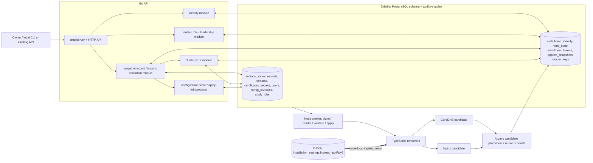

# Design: Primary–Node continuity (Phases 0–1)

## Scope and invariants

This design delivers only Phase 0 contracts/safety boundaries and Phase 1 local snapshot export/import. Enrollment transport, periodic node-pull synchronization, acknowledgements, dashboards, operational promotion/rejoin, election, failback, VIPs, database replication, and storage migration remain Phase 2–5 work.

Locked invariants:

- PostgreSQL remains the persistence layer for PRIMARY and NODE.
- A PRIMARY-generated cluster KEK encrypts replicated secrets; every installation caches that KEK encrypted by its own local master key. Promotion never re-encrypts replicated secrets.
- Phase 1 moves immutable archives locally. Future synchronization is node-pull over an authenticated channel and adds no inbound node management endpoint.
- Owner password hashes replicate. A per-node emergency local Owner is node-local and is never exported.
- Only a PRIMARY renews certificates. A disconnected NODE serves its last replicated certificate and does not run ACME renewal.
- The first successful standalone import retains the replaced standalone archive for exactly 30 days.
- Every role transition and standalone replacement requires an authenticated Owner.

## 1. Architecture overview



The API owns identity, authorization, snapshot integrity, compatibility, persistence, and job creation. The existing Node worker remains the apply executor. The explicit node-local seam is the `IngressAddresses` argument passed into `renderCoreDnsCandidate`; snapshot material never supplies that argument.

## 2. Identity, role, and leadership data flow

### Creation, persistence, and startup reads

| Value | Generation | Persistence | Startup behavior |
| --- | --- | --- | --- |
| `installation_id` | Cryptographically random UUID, inserted once with `INSERT ... ON CONFLICT DO NOTHING` during first schema initialization | Single row in `installation_identity`; immutable | Required before serving; reread from PostgreSQL on every start |
| `node_id` | Null for a fresh standalone installation; assigned once by future authenticated enrollment (Phase 2). Phase 1 local import may assign a local UUID only when explicitly transitioning B to NODE; it is never read from the snapshot | `node_state.node_id`, unique when non-null | Loaded with role state; mismatch/import attempts are rejected |
| `role` | Defaults to `standalone-primary`; transition contract permits `standalone-primary → node`, `node → primary`, and older primary → `stale-primary` | `node_state.role` | Determines mutation and ACME gates before HTTP handlers and renewal loop are enabled |
| `leadership_generation` | Starts at 1 for standalone-primary; future Owner-authorized promotion increments monotonically in one locked transaction | Current writable generation in `node_state.leadership_generation` | Compared to `latest_known_generation`; snapshots may raise latest-known but never lower it |
| `cluster_key` | 32 random bytes generated by PRIMARY at enrollment/cluster creation; never generated by a NODE during import | KEK ciphertext is a `secrets` row encrypted by the local master key; `cluster_keys` stores key ID, referenced secret ID, state, generation, timestamps | Cluster module unwraps only inside the secret-processing boundary; missing/invalid key disables import/apply of snapshots requiring it, not the existing data plane |

`installation_identity` is deliberately separate from snapshot identity. `sourcePrimaryId` identifies the exporting installation; it cannot replace B's `installation_id` or `node_id`.

### Startup stale-primary guard

`cmd/server/main.go` calls `identity.Ensure`, then `cluster.EvaluateStartup` after schema setup and before constructing writable routes or starting certificate renewal. Under a transaction/row lock it reads role, persisted writable generation, and latest known generation.

```mermaid
sequenceDiagram
  participant Main as cmd/server/main.go
  participant DB as PostgreSQL
  participant Guard as cluster.EvaluateStartup
  participant HTTP as HTTP server / renewal loop

  Main->>DB: EnsureSchema + Ensure installation identity
  Main->>Guard: EvaluateStartup(ctx)
  Guard->>DB: SELECT node_state FOR UPDATE
  alt leadership_generation < latest_known_generation
    Guard->>DB: set role=stale-primary, write_guard=true
    Guard-->>Main: guarded state + reason code stale_leadership
    Main->>HTTP: start read/data-plane APIs with mutation guard
    Note over Main,HTTP: Preserve current CoreDNS/Nginx; do not run ACME renewal
  else role == node
    Guard-->>Main: node read-only state
    Main->>HTTP: start; reject replicated mutations; no ACME renewal
  else current writable primary
    Guard-->>Main: writable primary state
    Main->>HTTP: start writable APIs + renewal loop
  end
```

The guard does not terminate the process or alter active files. It fail-closes control-plane writes. All replicated configuration mutation services receive a shared `WritePolicy`; middleware alone is insufficient because internal callers must also be guarded. NODE may mutate the allow-listed local ingress fields and may apply a validated imported snapshot. Unsupported recovery remains an explicit Phase 4 workflow.

### Transition authorization

Role transition and first standalone replacement service methods require a verified `auth.User` with role `owner`, acquire the `node_state` row lock, validate the state-machine edge and generation precondition, then commit role state. Operator attempts fail before writes. Phase 0 exposes contract/service boundaries and tests, not production promotion or enrollment commands.

## 3. Snapshot schema and serialization

### V1 envelope

```text
SnapshotV1
  snapshotVersion: 1
  replicationVersion: 1
  revisionId: UUID/string (immutable source revision)
  sourcePrimaryId: installation UUID
  leadershipGeneration: uint64 encoded as JSON integer
  contentHash: lowercase SHA-256 hex
  replicated: ReplicatedStateV1
  nodeLocal: NodeLocalOverlayV1
```

`nodeLocal` is a declarative overlay contract, not copied source values. In v1 it is a stable object such as `{ "ingress": "installation-settings", "dnsAddresses": "installation-settings" }`; import validates known overlay names and resolves them from B. It is hash-covered so changing overlay semantics changes snapshot identity.

### Final field classification

| Classification | Fields |
| --- | --- |
| **Replicated** | Managed zones and records (IDs, names, type/value, TTL, enabled, proxied, proxy settings); resolver pools and forwarding rules; proxy origins, protocols, headers/directives, path rules, timeouts, TLS/HTTP2/HTTP3/WebSocket/cache/Basic Auth references; stream listeners and upstreams; active certificate chain, encrypted private-key envelope, issuer/challenge/environment/status/expiry/renewal continuity metadata; provider connection metadata and encrypted credential envelopes; functional settings (default resolver/forwarding and non-host-specific retention/behavior settings); active Owner/Operator identities (stable ID, username, role, active/password-change flags, password hash); internal CA chain and encrypted key where required for continuity. |
| **Node-local** | `installation_id`, `node_id`, role, local/current/latest-known leadership state, local DNS/listen and ingress IPv4/IPv6, primary endpoint, enrollment credentials/token, locally encrypted cluster KEK, emergency Owner credential, host paths, runtime capabilities/settings, service health, applied timestamps, archive expiry. The snapshot carries only the `nodeLocal` overlay instructions, never source values. |
| **Transient/excluded** | Sessions, locks, apply jobs, rejected-candidate runtime state, complete audit history, logs, metrics, caches, health observations, updater state, worker claims/correlation runtime, temporary candidate files, process/environment state, PostgreSQL files. Import creates new local audit/job records rather than replicating them. |

`contentHash` is calculated over `StableStringify(snapshot with contentHash omitted)`. Validation parses into a strict typed schema, rejects unknown required semantics, reconstructs that hash input, and compares in constant time before persistence. `snapshotVersion` selects the physical envelope parser; `replicationVersion` selects replicated-data semantics. The accept-list therefore contains explicit pairs, initially only `(1,1)`.

`sourcePrimaryId` provides lineage and attribution, while `leadershipGeneration` provides replay ordering. For an established cluster, a lower generation than local latest-known is stale; a different source at the same generation is a conflict and fails closed. Phase 1's first standalone import establishes lineage only after successful activation. Neither field overwrites local identity.

Go's existing `apps/api/internal/domain/snapshot.go::StableStringify` is the canonical byte algorithm. The TypeScript mirror must consume shared JSON fixtures and produce exactly those UTF-8 bytes. Arrays are normalized into domain-defined stable order before serialization; object keys are lexicographically sorted. Export → parse → normalize → `StableStringify` must reproduce identical bytes and SHA-256 on amd64 and arm64. No export timestamp is included, because it would break unchanged-state byte stability.

## 4. Cluster-KEK secret model

The cluster KEK is 32 random bytes. A PRIMARY creates it at authenticated enrollment/cluster creation; Phase 0 provides generation/storage helpers, while actual channel provisioning is Phase 2. Each receiving installation immediately wraps it with `PROXYCORE_MASTER_KEY_BASE64` through the existing local secret store. The resulting local ciphertext is stored in `secrets`; `cluster_keys.secret_id` references it. Neither that locally wrapped blob nor plaintext KEK is exported.

Replicated secrets use AES-256-GCM and this envelope:

```text
v1.kek:<base64url(iv[12])>:<base64url(tag[16])>:<base64url(ciphertext)>
```

The prefix distinguishes cluster-key ciphertext from existing local `v1:` master-key ciphertext and is authenticated as AES-GCM AAD (`proxycore:v1:kek`) to prevent envelope substitution.

Go API (`apps/api/internal/cluster/`):

```go
GenerateKEK() ([]byte, error)
EncryptWithClusterKey(plaintext []byte, kek []byte) (string, error)
DecryptWithClusterKey(envelope string, kek []byte) ([]byte, error)
StoreClusterKey(ctx, keyID string, generation uint64, kek []byte) error
LoadActiveClusterKey(ctx) (keyID string, generation uint64, kek []byte, error)
```

TypeScript (`packages/crypto/src/cluster-kek.ts`):

```ts
generateClusterKey(): Buffer
encryptWithClusterKey(plaintext: string | Buffer, kek: Buffer): string
decryptWithClusterKey(envelope: string, kek: Buffer): Buffer
```

Helpers enforce exact key/IV/tag lengths, strict four-part parsing, authenticated decryption, generic redacted errors, and zero/short-lived plaintext buffers where practical. Snapshots carry KEK envelopes plus key IDs, never a KEK. Import verifies every required envelope before active mutation.

`cluster_keys` permits one `active` key and retained `decrypt-only` predecessors. The rotation seam is `RotateForPrimaryChange(newGeneration)`; it creates a new primary-owned key and records state without requiring a format change. Rotation execution/re-encryption policy is Phase 4. Ordinary restart, import, or NODE→PRIMARY role evaluation never rotates keys. A disconnected node can decrypt because its local master key unwraps its cached KEK, which then unwraps snapshot secrets without A.

## 5. Snapshot lifecycle (Phase 1)

```mermaid
sequenceDiagram
  actor Owner
  participant Export as snapshot.Exporter (A)
  participant File as Immutable local blob
  participant Import as snapshot.Importer (B)
  participant DB as PostgreSQL
  participant Worker as Node worker
  participant Render as TS renderers
  participant FS as Candidate/active files

  Owner->>Export: Export(revision)
  Export->>DB: Read one consistent desired revision + identities + secret envelopes
  Export->>Export: Normalize + StableStringify + SHA-256
  Export-->>File: SnapshotV1 bytes
  Owner->>Import: Import(blob, owner)
  Import->>Import: Parse/version/hash/generation/reference/secret validation
  Import->>DB: Read B-local ingress and previous known-good
  Import->>Render: Preflight complete CoreDNS + Nginx candidate with B ingress
  Render-->>Import: Valid candidates/checksums
  alt validation fails
    Import->>DB: Record redacted rejection only
    Import-->>Owner: reject; active/desired/role unchanged
  else eligible
    Import->>DB: BEGIN; lock import/revision state
    Import->>DB: Archive standalone state if first import; expiry=activation+30d
    Import->>DB: Insert imported revision + apply job source="import"
    Import->>DB: Record pending applied_snapshots row; COMMIT + notify
    Worker->>DB: Claim job
    Worker->>Render: Render again using current B-local ingress
    Render->>FS: Write isolated complete candidate
    Worker->>FS: validate CoreDNS + Nginx
    Worker->>FS: promote both as one logical revision, reload, health-check
    alt any apply/health stage fails
      Worker->>FS: restore/continue complete previous-known-good
      Worker->>DB: transaction: failed/rolled-back; retain prior last-successful
    else healthy
      Worker->>DB: transaction: mark revision/job applied and snapshot last-successful
      Worker->>DB: start standalone archive 30-day retention from successful activation
    end
  end
```

### Atomicity boundary

Database creation of the imported revision, pending `applied_snapshots` record, and `apply_jobs` row is one transaction under the existing advisory/revision lock. Filesystem activation cannot be a PostgreSQL transaction; it is made logically atomic by a revision-scoped candidate directory, validation of both complete candidates before promotion, retained complete previous-known-good files, coordinated promotion/reload, and mandatory rollback on any promotion/reload/health failure. `current_applied_revision_id` and `applied_snapshots.status=applied` advance together only after both services pass health checks.

The prior known-good revision is never deleted by candidate failure. Failed candidates remain diagnostic and cannot become latest-successful. Revisions and jobs add structured attribution: `source: "import"`, actor ID, source primary ID, source revision ID, hash, and leadership generation; no secret plaintext is logged.

The standalone archive is staged during the transaction but its 30-day expiry is based on successful activation. A failed import neither starts nor shortens retention. Cleanup selects expired `kind=standalone-archive` rows only and cannot delete active or previous-known-good imported rows.

## 6. Node-local rendering

`installation_settings.ingress_ipv4` and `ingress_ipv6` remain B-local. Import excludes A's ingress and resolves `IngressAddresses` immediately before each preflight and worker render. A concurrent local ingress change is handled by rerendering in the worker; snapshot content hash stays unchanged while candidate checksums differ by node.

`packages/renderers/src/coredns.ts` is already node-local-ready: `renderCoreDnsCandidate` accepts `ingress`, passes it to record validation and `renderZoneFile`, and `proxiedAnswers` emits A/AAAA answers from `ingress.ipv4`/`ingress.ipv6`. The implementation should preserve this seam; only fixtures and caller wiring are required.

`packages/renderers/src/nginx.ts` takes records, streams, capabilities, candidate path, and extra files—no ingress address. Thus the same accepted replicated routes produce equivalent hosts, paths, protocols, TLS/auth behavior, and origins on A and B. Local DNS ingress differences do not rewrite Nginx upstreams.

## 7. Compatibility and rollback

The importer owns a compile-time explicit accept-list, initially `{ snapshotVersion: 1, replicationVersion: 1 }`. It checks the pair before decrypting, rendering, archiving, changing desired state, role, or generation. Unknown/newer `snapshotVersion`, unsupported replication semantics, malformed schema, bad hash, stale/conflicting lineage, broken references, unavailable KEK, failed authenticated decryption, or invalid rendered candidate return stable redacted reason codes.

For a newer physical or replication version, the local rejection is `software_update_required` and includes supported/received version numbers but no snapshot secret data. This is also the Phase 0 cross-version handshake contract for future node-pull: the node advertises its accepted pairs; if the primary offers only newer schema, the node refuses the blob and reports that software must be updated. No downgrade transformation is attempted.

Validation rejection leaves role, desired state, active files, local settings, latest-known generation, and latest-successful snapshot untouched. Apply failure restores or continues the retained prior known-good revision. Rollback to a prior snapshot is allowed only through the same validation/apply path and may not reduce latest-known leadership generation.

## 8. Schema migration plan

All changes are additive and idempotent through `configuration.EnsureSchema`, mirrored in `packages/db/src/schema.ts` and a normal Drizzle migration. Constraints use check clauses/enums and foreign keys where practical.

| Table | Purpose and principal columns |
| --- | --- |
| `installation_identity` | Single row (`id='default'`), immutable `installation_id uuid unique not null`, `created_at`; insert-once initialization |
| `node_state` | Single row, `node_id uuid unique null`, role enum (`standalone-primary`, `node`, `primary`, `stale-primary`), `leadership_generation bigint >= 1`, `latest_known_generation bigint >= leadership_generation`, `write_guard boolean`, `source_primary_id uuid null`, timestamps |
| `enrollment_tokens` | Phase 2 placeholder only: token ID/hash, expiry, consumed/revoked timestamps, creator; no Phase 0/1 endpoint or token generation behavior |
| `applied_snapshots` | Candidate identity/version/hash/source/generation, local revision/job references, `kind` (`imported`, `standalone-archive`), status (`pending`, `applied`, `rejected`, `rolled-back`, `archived`), redacted reason, immutable blob/archive JSON, activation/expiry timestamps, `is_previous_known_good`; indexes for latest-successful and expiry cleanup |
| `cluster_keys` | `key_id`, generation, `secret_id` FK to `secrets` containing locally master-key-encrypted KEK, state (`active`, `decrypt-only`, `retired`), created/activated/retired timestamps; unique active-key constraint |

`config_revisions` and `apply_jobs` gain import attribution columns or a structured non-secret attribution JSON plus an explicit source enum/text. Prefer explicit `source`, `source_primary_id`, `source_revision_id`, `snapshot_content_hash`, and `leadership_generation` columns for queryability. Use `bigint` for generations; Go validates non-negative conversion. No Phase 0 rollback drops these tables because Phase 1 depends on them.

## 9. File-change forecast

### New

- `apps/api/internal/identity/identity.go`, `store.go`, and focused tests
- `apps/api/internal/cluster/role.go`, `startup_guard.go`, `kek.go`, stores, and focused tests
- `apps/api/internal/snapshot/schema.go`, `serialize.go`, `compatibility.go`, `export.go`, `validate.go`, `import.go`, archive/apply integration, and focused tests
- `packages/crypto/src/cluster-kek.ts` and `cluster-kek.test.ts` (exported by package index)
- TypeScript snapshot contract mirror in the appropriate domain package
- `packages/renderers/src/__fixtures__/primary-node/` shared snapshot, primary-A/node-B ingress inputs, expected logical outputs, and architecture-neutral canonical bytes/hash
- `docs/runbooks/primary-node.md`; security additions in `docs/security-operations.md`

### Updated

- `apps/api/cmd/server/main.go`: identity initialization, startup stale-primary evaluation, write policy, and role-gated renewal loop
- `apps/api/internal/configuration/schema.go`: additive tables/types/columns/indexes
- `apps/api/internal/configuration/store.go`: imported revision/job transaction and previous-known-good linkage
- `packages/db/src/schema.ts`: exact Drizzle mirrors and exports
- `packages/crypto/src/index.ts`: export cluster-KEK API
- worker claim/apply persistence only where required to finalize imported snapshot status and rollback
- `packages/renderers/src/coredns.test.ts`: primary-A versus node-B fixture; renderer source should remain unchanged unless the test reveals a missing caller seam
- Nginx renderer tests for route/origin equivalence; no ingress-related renderer change expected

## 10. Strict-TDD and work-unit test plan

Each unit starts with the named focused failing test (RED), receives the smallest behavior implementation (GREEN), then adds at least one triangulating case where noted. Tests and behavior stay in the same commit. Narrow package commands run first; the Go regression boundary is `cd apps/api && go test ./...`; TypeScript uses the repository's focused Vitest command followed by the relevant workspace suite.

| Work unit | RED behavior | GREEN / triangulation | Runtime boundary | Focused rollback |
| --- | --- | --- | --- | --- |
| P0.1 identity/role types + persistence | Fresh init yields one stable installation ID, standalone role, generation 1; restart preserves values | Concurrent initialization produces one row; invalid roles/generation regression rejected | Start API twice against test PostgreSQL and inspect stable identity | Revert identity/role files and startup reader; leave additive tables inert |
| P0.2 schema + Drizzle parity | Schema integration test cannot query required tables/constraints | `EnsureSchema` twice succeeds; Go and Drizzle names/constraints match | Apply migration to disposable PostgreSQL | Revert schema readers/writers and mirror; **do not drop tables**, because Phase 1 needs them |
| P0.3 cluster KEK | Go/TS known fixture cannot produce/decrypt `v1.kek` envelope | Cross-language decrypt, tamper/wrong-key/malformed tests; local master-key wrap survives restart | Store/reload KEK from disposable PostgreSQL with A absent | Revert KEK consumers/helpers together; retain referenced key rows/ciphertext |
| P0.4 snapshot contract/canonicalization | Shared fixture bytes/hash differ or local/transient data leaks | Repeated and Go/TS round trip stable; reordered maps equal; changed semantic field differs | N/A: pure serialization contract | Revert snapshot types/serializers and fixture together; stored blobs remain inert |
| P0.5 compatibility + transition guards | Unsupported pair, stale generation, Operator transition, NODE mutation currently pass | Stable reason codes; `(1,1)` accepted; node-local ingress allowed; same-generation/different-source rejected | Exercise service/API boundary against disposable DB | Revert guards only together with disabling import/transition entry points |
| P0.6 stale-primary startup guard | Older writable generation starts mutation/renewal path | Startup becomes guarded while existing data plane remains; equal/new generation does not guard | Start API fixture in each role and probe mutation/renewal wiring | Revert `main.go` and guard package together only if imports/role transitions are disabled |
| P0.7 threat/rollback docs | Contract checklist identifies missing threat or rollback mapping | Document key exposure, replay, archive, split-brain, redaction, recovery | N/A: documentation contract | Revert docs independently only if corresponding behavior is also removed |
| P1.1 exporter | Unchanged exports differ or omit promotable field | Byte-identical repeated export; consistent DB revision read; cross-arch fixture | Export local file from A fixture | Revert export command/service/fixtures; no active-state mutation |
| P1.2 validator | Bad hash/version/reference/secret/render candidate reaches persistence | Table-driven explicit failures with zero active/desired/role mutation; valid candidate eligible | Import-check local fixture without apply | Revert validator only while import is disabled |
| P1.3 importer/archive/job attribution | Valid local blob lacks archive or ordinary job is indistinguishable | One DB transaction creates import revision/job/pending record; successful activation starts exact 30-day retention; failed import does not | Local A export → B enqueue with A offline | Disable import, cancel purge, restore retained archive; keep diagnostic rows |
| P1.4 atomic apply/rollback | Injected Nginx/reload/health failure leaves mixed or advances latest | Failure at each stage retains/restores both prior configs; success advances both pointers once | Worker applies valid fixture, then fault-injected fixture | Route imports away from worker and reactivate recorded previous-known-good; retain diagnostics |
| P1.5 node-local/cross-arch fixtures | A ingress leaks into B or canonical bytes vary | DNS-only answers and Nginx origins equal; proxied A/AAAA differ by local ingress; run amd64/arm64 CI matrix | Render fixture on supported architecture containers | Revert tests/fixtures independently; no runtime mutation |
| P1.6 offline/runbook/cleanup | NODE attempts ACME or archive purge removes protected state | NODE serves bounded offline test, no renewal call; cleanup only after exact expiry and preserves active/previous-known-good | Stop A and probe B DNS/Nginx for bounded test interval | Revert runbook/cleanup loop; preserve archives until explicit safe cleanup |

Go database tests use isolated test schemas/containers and skip external integration under `testing.Short()` where needed. Multiple cases are table-driven with scenario names. File tests use `t.TempDir()`. Crypto randomness is asserted by decryptability/tamper behavior; deterministic cross-language vectors inject fixed key/IV only through test-only seams. Renderer fixtures are checked without architecture-dependent timestamps, paths, or line endings.

The implementation will exceed the normal 400-line review budget. The locked `exception-ok` decision records the accepted `size:exception`; it does not justify code-golfing. Commits remain cohesive work units and include tests, focused command/result evidence, runtime evidence (or explicit N/A), and the rollback stated above.

## 11. Rollback boundary summary

Every Phase 0 unit is independently reversible at its service boundary. Revert the relevant package, wiring, and tests as one work unit; do not partially remove a guard while leaving its mutation entry point active. Additive schema objects remain inert on rollback—there is no Phase 0 migration drop—because Phase 1 also needs the new tables and destructive rollback risks identity/key/archive loss. Cluster key rows and snapshot blobs remain until no references exist and a separately authorized, backed-up cleanup is performed.

For Phase 1, disable import first, stop/cancel archive cleanup, restore or retain the recorded previous-known-good revision, and verify both services before deleting any diagnostic candidate. Database rollback never lowers latest-known leadership generation.

## 12. Security and operational boundaries

- Snapshot files are sensitive ciphertext-bearing artifacts: Owner-only export/import, restrictive local permissions, no ordinary API serialization, no secret-bearing logs.
- Authentication authorizes the operation; hash, version, generation, lineage, reference, decryptability, renderer, and health checks authorize the data.
- Replicated password hashes preserve Owner identity but do not replicate sessions. The emergency Owner remains local and is excluded from exports.
- NODE write policy blocks DNS/proxy/certificate/functional-setting/replicated-admin mutations but permits local ingress and worker-owned validated apply.
- NODE never renews certificates. PRIMARY remains the renewal owner; disconnected NODE retains its last valid replicated certificate.
- Phase 1 has no network management surface and makes no acknowledgement to A.

## 13. Rejected alternatives

- **Node-local re-encryption of replicated secrets:** rejected because it adds transformation failure modes, breaks byte-portable snapshots, and makes offline promotion dependent on complete re-encryption.
- **Primary-push transport:** rejected because it introduces an inbound management surface on nodes. Future transport is authenticated node-pull through the existing API boundary.
- **SQLite migration for NODE:** rejected by scope and PRD non-goals; PostgreSQL already provides revisions, jobs, auditability, retention, and rollback state.
- **VIP-based continuity:** explicitly rejected by the PRD; continuity is independent data-plane service plus client resolver configuration, not address takeover.

## Decision consequences and risks

- **Cross-language drift:** one canonical algorithm, explicit version pair, and shared fixture bytes/hash are release gates.
- **Filesystem atomicity:** PostgreSQL alone cannot make two service file trees atomic; revision-scoped candidates and complete previous-known-good rollback are mandatory.
- **Master-key loss:** a locally cached KEK is only as recoverable as the installation master key. Backup/restore guidance must treat them as a pair without exporting plaintext keys.
- **Generation knowledge:** Phase 1 only validates locally known generations; distributed freshness is intentionally deferred to node-pull. The contract fails closed when newer knowledge exists but cannot claim consensus.
- **Archive sensitivity:** the 30-day standalone archive may contain credentials and receives the same at-rest/access controls as active snapshots.
