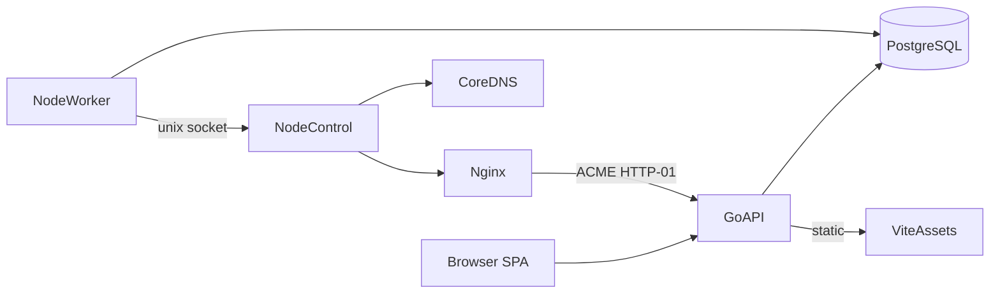

# Design: Go API + Vite SPA control plane

## Architecture

- **Go API** owns HTTP, sessions, desired-state mutations, certificate requests,
  and SPA static hosting (SPA fallback to `index.html`).
- **Vite SPA** is build-time static files; no SSR.
- **Worker/control** stay Node and continue the apply path against the same DB.
- **Nginx** remains `network_mode: host`; ACME challenges proxy to
  `NGINX_ACME_UPSTREAM` (host-published API port).

## Auth compatibility

Existing password hashes use:

`scrypt$N$r$p$salt_b64url$derived_b64url` with N=16384, r=8, p=1, keyLen=64.

Opaque session tokens are 32 random bytes (base64url); only SHA-256 hex of the
token is stored. Cookie name defaults to `proxycore_session`, HttpOnly,
SameSite=Lax, Secure in production. Bearer tokens remain accepted.

Go MUST verify/create hashes in this format so existing installs keep working.

## API contract

Preserve the Next route shapes under `/api/*` (JSON). Handlers return
`{ error: string }` on failure with appropriate HTTP status. Public certificate
listings MUST omit `secretId` and `certificatePem`.

## Apply / certificates

Mutations that previously called `configuration.createApplyJob` MUST enqueue
the same job/revision rows the Node worker already understands. Certificate
issuance may run inside the Go process (preferred) or enqueue `certificate`
jobs if the worker already performs issuance—match current MVP behavior where
the web process issues via certificate adapters and then queues apply.

## Compose topology

| Service | Role |
| --- | --- |
| `api` | Go binary + SPA assets; port `WEB_PORT` |
| `migrate` | Node Drizzle one-shot (`profiles: [tools]`) |
| `worker` / `control` | Unchanged Node images |
| `postgres` / `coredns` / `nginx` | Unchanged product roles |
| `web` (Next) | Removed from default Compose |

## Transitional Node configuration API

Until Phase 3 finishes porting every configuration route to Go, Compose runs
`node-api`: a **tsx** process (`apps/web/src/standalone.ts`) that reuses the
existing TypeScript handlers **without** `next build`. The Go `api` service:

1. serves the Vite SPA;
2. owns `/api/health` and `/api/auth/*`;
3. reverse-proxies other `/api/*` to `node-api`.

This removes Next.js from the default path immediately while keeping product
parity. Phase 3 retires `node-api` route-by-route.

## Rejected alternatives

- **SQLite in this change** — deferred by operator choice.
- **Keep Next SSR in Compose** — leaves the heavy build/runtime.
- **Proxy Go → Next standalone** — still requires `next build`.
- **Port worker/control now** — expands scope beyond the control-plane RAM fix.

## Security controls

- `api` MUST NOT mount the Docker socket.
- Master key stays in env; secrets remain encrypted at rest.
- SPA is static; all authorization stays on the API.
