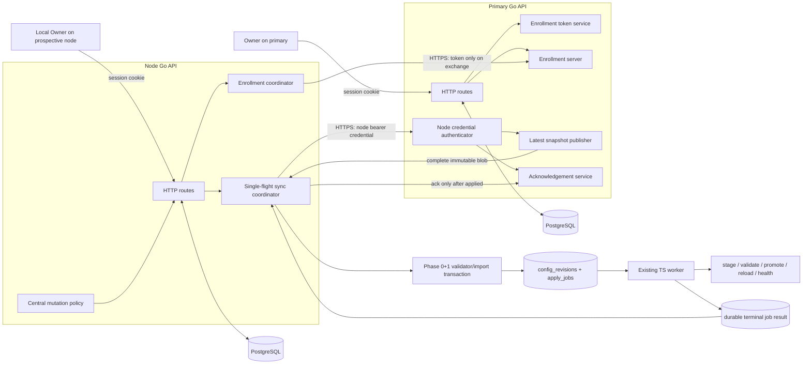

# Design: Primary/Node continuity — Phase 2

## Scope and architectural invariants

Phase 2 adds secure standalone-to-node enrollment and node-pull synchronization to the Phase 0+1 snapshot/apply foundation. It does not add promotion/rejoin, election, push control, database replication, a node operations dashboard, rich inventory/diagnostics, credential rotation, or remote data-plane disablement.

Locked invariants:

- PostgreSQL remains authoritative for durable control-plane state on both installations.
- The Go API owns HTTP authentication, authorization, enrollment orchestration, topology state, token and credential lifecycle, snapshot transport, and synchronization scheduling. The TypeScript worker remains the only executor of candidate render/validate/promote/reload/health work.
- An Owner session is never accepted as a node credential, and a node credential is never accepted on Owner/configuration routes. Enrollment-token authentication is accepted only by the enrollment exchange endpoint.
- The existing complete immutable snapshot and canonical Phase 0+1 apply pipeline remain the replication unit and activation gate. Phase 2 does not replay mutations or introduce a second apply implementation.
- `NODE` is committed only after identity confirmation, standalone archival, local KEK wrapping, durable node credential storage, and successful initial snapshot apply. Until that transaction commits, ordinary standalone write authority remains unchanged.
- The primary renews certificates. A node neither runs ACME renewal nor requires the primary to continue serving its last valid certificate and data-plane snapshot.
- Secrets are never included in URLs, logs, metrics labels, audit before/after JSON, ordinary status responses, or error details.

## 1. Architecture and privilege boundaries



Three independent principals are enforced by separate middleware/service capabilities:

1. **Owner session:** existing local session authentication plus `owner` role; creates/revokes enrollment authorization on a writable primary and starts/cancels/recovers enrollment or manual retry locally.
2. **Enrollment token:** narrowly authorizes one server-side enrollment exchange. It cannot pull snapshots, acknowledge, mutate configuration, list nodes, or invoke Owner routes.
3. **Node credential:** identifies exactly one node and authorizes only snapshot metadata/download and acknowledgement. Every request checks current server-side credential state; no cached “authenticated” session may outlive revocation.

Worker authority is an in-process capability, not HTTP identity. Only the enrollment/sync coordinator may enqueue a revision with `source='sync'`; the worker may apply that validated revision but cannot change topology, enrollment, credentials, or primary records.

## 2. Persistence schema

Phase 0+1 already provides `installation_identity`, `cluster_keys`, `node_state`, and `applied_snapshots`, but the current `node_state.enrollment_token_hash` placeholder conflates primary token state with local enrollment state. Phase 2 replaces that conceptual use with additive, purpose-specific records. Existing columns remain readable/inert for rollback compatibility and are not populated by new code.

All timestamps are UTC `timestamptz`; identifiers are UUIDs; state columns use checked text/enums. Go `EnsureSchema`, the Drizzle schema, and a normal additive migration must match exactly.

### Primary-side tables

| Table | Principal columns and constraints |
| --- | --- |
| `enrollment_tokens` | `id`, `token_selector unique`, `token_hash`, `hash_version`, `created_by_user_id`, `created_at`, `expires_at`, `consumed_at`, `consumed_by_attempt_id`, `revoked_at`; check expiry after creation; hash only, never plaintext. Selector is non-secret lookup material. |
| `enrolled_nodes` | `node_id primary key`, `installation_id unique`, `primary_id`, `display_name nullable`, `credential_id unique`, `enrolled_at`, `revoked_at nullable`, `created_by_attempt_id unique`; this is lifecycle/security state, not a Phase 3 inventory model. |
| `node_credentials` | `id`, `node_id`, `credential_hash`, `hash_version`, `created_at`, `last_authenticated_at nullable`, `revoked_at nullable`; one active credential per node in Phase 2; hash only. Rotation history is deferred. |
| `enrollment_grants` | `attempt_id primary key`, `token_id unique`, `installation_id`, `node_id`, `primary_id`, `primary_generation`, `node_ephemeral_public_key`, `sealed_bootstrap_payload`, `payload_hash`, `created_at`, `expires_at`; supports idempotent retrieval of the same issued credential/KEK package after a response interruption without storing either plaintext. |
| `node_snapshot_acks` | `(node_id, content_hash) primary key`, snapshot/revision/version/generation fields, `applied_at` reported by node, `received_at`; monotonic per-node generation/revision checks; acknowledgement metadata only. |

`enrollment_grants` is short-lived bootstrap recovery state, automatically purged after its expiry only after the associated node exists. `sealed_bootstrap_payload` is encrypted to the prospective node's one-attempt X25519 public key and contains the primary-issued node bearer secret plus cluster KEK. It is not an ordinary API field and is useful only with the node-held ephemeral private key.

### Node-side tables

| Table | Principal columns and constraints |
| --- | --- |
| `enrollment_attempts` | `id`, `state`, `primary_url`, `expected_primary_id nullable`, verified identity fields/fingerprint, `local_node_ip`, `archive_id nullable`, `ephemeral_private_key_wrapped`, `bootstrap_payload nullable`, `node_credential_secret_id nullable`, `cluster_key_id nullable`, `initial_snapshot_hash/revision/job_id nullable`, `failure_code nullable`, `confirmed_at`, `created_at`, `updated_at`; one non-terminal attempt via partial unique index. No token column. |
| `node_state` additions | `enrollment_attempt_id unique nullable`, `primary_url`, `primary_installation_id`, `primary_tls_spki_sha256`, `credential_id`, `sync_enabled`, `last_attempt_at`, `last_success_at`, `consecutive_failures`, `next_attempt_at`, `last_error_code`; singleton row. |
| `sync_attempts` | `id`, `trigger` (`enrollment`,`periodic`,`manual`,`restart`), `status`, snapshot identifiers, `apply_job_id nullable`, redacted `result_code`, timestamps; bounded diagnostic history, never a mutation queue. |
| `standalone_archives` | durable encrypted snapshot/archive blob, capture reason, `retention_started_at`, `expires_at`, restoration eligibility; reuses the Phase 1 `ArchiveStore` contract and fixed 30-day policy. |

The node bearer secret and enrollment ephemeral private key are persisted through the existing local secret store (AES-GCM under `PROXYCORE_MASTER_KEY_BASE64`); tables hold only secret IDs or locally wrapped ciphertext. The cluster KEK is immediately wrapped under that same node-local master key and stored in `cluster_keys.wrapped_kek`. Plaintext key material exists only in bounded memory and is zeroed where practical.

`config_revisions` and `apply_jobs` gain explicit non-secret attribution: `source` (`ordinary`,`import`,`sync`), `source_primary_id`, `source_node_id`, `source_revision_id`, `snapshot_content_hash`, `snapshot_version`, `replication_version`, and `leadership_generation`. `applied_snapshots` gains pending/terminal status or an equivalent linked record so the Go coordinator can determine the exact worker outcome after restart. Existing worker job states remain authoritative for apply completion.

## 3. Token format, hashing, and atomic consumption

A plaintext token is 32 random bytes and is returned exactly once as `pcenr1_<selector>_<secret>`. The selector is random, non-secret lookup material; the secret carries at least 256 bits. Persistence uses `SHA-256(domain-separator || secret)` initially, recorded with `hash_version='sha256-v1'`; comparison is constant-time. A deployment pepper may be added only as a versioned hashing scheme—database-only compromise resistance must not silently depend on an unavailable key.

Creation validates a bounded server-configured TTL (recommended default 15 minutes, allowed 5–60 minutes), inserts only selector/hash/lifecycle metadata, and writes a redacted audit event. Raw request bodies and Authorization headers are not logged.

The enrollment exchange transaction performs:

```sql
SELECT * FROM enrollment_tokens
 WHERE token_selector=$1
 FOR UPDATE;
-- constant-time hash check, not expired/revoked/consumed
-- validate PRIMARY role and request attempt/installation/node binding
INSERT enrollment_grants ...;
INSERT node_credentials ... credential_hash only;
INSERT enrolled_nodes ...;
UPDATE enrollment_tokens
   SET consumed_at=now(), consumed_by_attempt_id=$attempt
 WHERE id=$token AND consumed_at IS NULL;
COMMIT;
```

A retry with the same `attempt_id`, installation/node identity, and node ephemeral public key returns the same sealed grant until grant expiry; it does not issue a second credential. Any different binding receives `TOKEN_CONSUMED`. Thus token consumption, credential authorization, node binding, and recoverable sealed delivery are one atomic primary transaction. The token is never accepted for later pull/ack. Database uniqueness and row locking, not process-local locks, prevent races across API replicas.

## 4. TLS and primary identity binding

Enrollment requires `https://`; redirects to another origin are rejected. Normal PKI hostname validation is mandatory unless the product is explicitly configured with the existing installation CA trust material. `skipVerify` is not supported.

`POST /api/topology/enrollment/preview` uses the enrollment token to rate-limit and authenticate the preview but does not consume it or disclose KEK/credential data. The response contains:

- canonical primary URL/host,
- primary `installationId` and stable `nodeId`,
- leadership generation and writable-primary role,
- TLS leaf certificate SHA-256 SPKI fingerprint and validity,
- installation CA fingerprint when available,
- a nonce-bound identity proof signed by the installation CA/private identity boundary over `(attemptId, nodeInstallationId, primaryInstallationId, primaryNodeId, generation, canonicalURL, TLS-SPKI, nonce, expiresAt)`.

The node verifies HTTPS, proof signature, nonce, attempt binding, role, and expiry, then durably stores the identity summary and TLS SPKI pin in the pending attempt. The UI displays the installation ID, node ID, canonical address, and certificate/CA fingerprint. Owner confirmation records the exact preview digest; a changed host, certificate key, primary ID, generation regression, or expired proof forces a new preview and confirmation. Certificate renewal using the same key remains valid; a changed SPKI requires explicit reconfirmation during uncommitted enrollment. After commit, Phase 2 pins primary installation identity and CA/SPKI trust according to deployed TLS mode; it never follows a response claiming another primary identity.

This is explicit operator-confirmed identity binding, not automatic discovery or election. It does not make self-signed identity trustworthy without Owner comparison to an out-of-band expectation.

## 5. Enrollment state machine and safe commit point

Durable node-local states are:

```text
DRAFT -> VERIFIED -> CONFIRMED -> EXCHANGED -> ARCHIVED
      -> INITIAL_APPLY_PENDING -> COMMITTED

Any pre-commit state -> CANCELLED
CONFIRMED..INITIAL_APPLY_PENDING -> RECOVERABLE on interruption/failure
RECOVERABLE -> prior safe stage (idempotent resume) or CANCELLED
```

`FAILED` is a terminal presentation for non-recoverable input/security failures; it remains standalone and may start a fresh attempt after cleanup. `RECOVERABLE` means durable prerequisites allow safe resume. State transitions use `SELECT ... FOR UPDATE`, compare-and-set expected state, and one active-attempt constraint.

```mermaid
sequenceDiagram
  actor Owner
  participant UI as Node settings UI
  participant N as Node API / enrollment coordinator
  participant P as Primary enrollment API
  participant DBN as Node PostgreSQL
  participant DBP as Primary PostgreSQL
  participant W as Existing worker

  Owner->>UI: enter node IP, primary URL, token; Save
  UI->>N: POST /enrollment/preview
  N->>DBN: create DRAFT; wrap ephemeral private key
  N->>P: HTTPS preview(token, attempt, nonce, node identity, ephemeral public key)
  P-->>N: signed identity + TLS/CA fingerprints
  N->>N: verify TLS, signature, nonce, role, binding
  N->>DBN: VERIFIED; store preview digest (never token)
  N-->>UI: verified identity + destructive warning
  Owner->>UI: explicit Confirm
  UI->>N: POST /enrollment/{attempt}/confirm {previewDigest}
  N->>DBN: CONFIRMED
  N->>P: exchange(token held only in request memory, confirmed proof)
  P->>DBP: transaction: consume token + issue credential + sealed KEK grant
  P-->>N: sealed bootstrap grant
  N->>DBN: unwrap in memory; locally wrap credential and KEK; EXCHANGED
  N->>DBN: archive standalone desired state; ARCHIVED
  N->>P: pull latest complete snapshot with node credential
  N->>DBN: canonical validate + enqueue source=sync; INITIAL_APPLY_PENDING
  W->>DBN: claim, render, validate, promote, reload, health
  W-->>DBN: exact job APPLIED or failed/rolled-back
  alt exact initial job applied and hash matches
    N->>DBN: one transaction: mark attempt COMMITTED, role=NODE, bind primary/credential/snapshot, enable sync
    N->>P: acknowledge exact applied snapshot
    N-->>UI: committed NODE
  else apply failed/interrupted
    N->>DBN: RECOVERABLE; preserve standalone archive and role
    N-->>UI: recoverable standalone; no acknowledgement
  end
```

The **safe commit point** is one node PostgreSQL transaction executed only after the linked initial apply job is terminal `applied`, the matching `config_revision.applied_at` exists, and snapshot version/revision/hash/generation equal the pending attempt. It updates `installation_identity.role='node'`, primary lineage/latest-known generation, singleton `node_state`, `applied_snapshots`, and `enrollment_attempts.state='committed'`. The central mutation guard reads the committed identity state; it is not activated by form submission, token consumption, archive creation, or job enqueue.

Because the filesystem may already hold the initial applied candidate immediately before this database commit, restart recovery treats `INITIAL_APPLY_PENDING + exact applied job` as commit-ready and completes the transaction idempotently. If the job failed/rolled back, the installation remains standalone; recovery restores/continues the archived standalone desired and active state through the canonical apply path before allowing cancellation. It never directly edits active files. Cancellation after bootstrap revokes the unused primary credential best-effort and deletes local wrapped bootstrap secrets only after standalone serviceability is confirmed. A primary-side orphan record is harmless and can be Owner-revoked; Phase 3 cleanup UX is out of scope.

The archive's 30-day retention clock starts at successful node commit, not at capture, and repeated recovery never shortens `expires_at`.

## 6. Cluster-KEK transfer and local wrapping

The primary loads the active cluster KEK only inside the existing Go cluster/secret boundary. It builds a bootstrap payload containing `credentialId`, plaintext bearer secret, `clusterKeyId`, KEK bytes, primary identity/generation, attempt ID, and expiry. Hybrid encryption uses ephemeral X25519 plus HKDF-SHA-256 and AES-256-GCM, with all identity/binding fields as authenticated associated data. Only the node's wrapped one-attempt private key can open the stored sealed payload.

On receipt, the node:

1. verifies payload AAD and expected attempt/primary/node bindings;
2. wraps the KEK with its node-local master key into the existing local `cluster_keys` format;
3. wraps the bearer secret through the local secret store;
4. commits both references and `EXCHANGED` state atomically;
5. discards plaintext buffers and, after commit, the ephemeral private key when grant recovery is no longer needed.

Failure to unwrap, validate, or durably wrap either value leaves the attempt uncommitted/recoverable and prevents snapshot download/apply. The KEK is not included in snapshots, acknowledgement, status, or audit payloads. Existing `v1.kek:` replicated secret envelopes remain unchanged.

## 7. Node credential lifecycle and revocation

The primary generates a 32-byte opaque bearer secret and stores only its domain-separated SHA-256 hash. The node stores plaintext only under its local master key. Requests use `Authorization: Bearer <credential>` and a dedicated node-auth middleware; credentials are never cookies and never accepted from query parameters.

Every pull and ack joins `node_credentials` to `enrolled_nodes` and checks credential hash, node binding, both revocation timestamps, and primary identity inside the request transaction. Revocation is `POST /api/topology/nodes/{nodeId}/revoke`, Owner-only on a writable primary, idempotently setting both revocation timestamps and emitting redacted audit metadata. It takes effect on the next request; snapshot responses are streamed only after authorization. Revocation does not call the node, erase its data, expire its certificate, or stop its data plane.

Phase 2 supports issue-on-enrollment and revoke, not rotation, rejoin, promotion credential changes, remote reset, or rich node inventory.

## 8. HTTP endpoint contracts

All JSON endpoints use stable error `code` values and generic messages. Request size/time limits, per-selector/IP rate limits for token endpoints, and `Cache-Control: no-store` apply to enrollment responses. Secret-bearing success responses are never cached.

### Owner/session endpoints

| Method and path | Authority | Contract |
| --- | --- | --- |
| `POST /api/topology/enrollment-tokens` | local Owner; writable PRIMARY | Body `{expiresInSeconds}`; returns `201 {token, expiresAt}` exactly once. |
| `DELETE /api/topology/enrollment-tokens/{id}` | local Owner; writable PRIMARY | Idempotent revoke; `204`. Does not reveal hash/token. |
| `POST /api/topology/nodes/{nodeId}/revoke` | local Owner; writable PRIMARY | Idempotent immediate credential revocation; minimal `{nodeId, revokedAt}`. |
| `GET /api/topology/enrollment` | local authenticated user (write actions Owner-only) | Local role plus durable attempt state and permitted actions; no secrets. |
| `POST /api/topology/enrollment/preview` | local Owner; standalone | `{localNodeIp, primaryUrl, token}`; server proxies preview and returns verified display fields, `attemptId`, `previewDigest`; token is not persisted. |
| `POST /api/topology/enrollment/{attemptId}/confirm` | local Owner; standalone | `{previewDigest, confirmReplacement:true}`; starts/resumes staged exchange/archive/initial apply; `202` with state. |
| `POST /api/topology/enrollment/{attemptId}/recover` | local Owner; standalone | Idempotently resumes server-selected safe stage; `202`. |
| `DELETE /api/topology/enrollment/{attemptId}` | local Owner; pre-commit only | Cancels only when server reports cancellation safe; `204/409`. |
| `POST /api/topology/sync/retry` | local Owner; committed NODE | Coalesces one pending trigger; `202 {status:'scheduled'|'already-running'}`. |
| `GET /api/topology/sync` | local authenticated user | Essential last-applied/attempt/success, next attempt, enabled and redacted status only. |

### Enrollment-token endpoint

`POST /api/topology/enroll` accepts the token in the Authorization header using a distinct `Enrollment` scheme plus attempt, proof, node identity, and ephemeral public key in the body. First success returns `201` with the sealed bootstrap payload. An exact idempotent retry returns the same payload. Expired, revoked, replayed with different bindings, or invalid tokens return one indistinguishable `401 ENROLLMENT_DENIED`; detailed reason remains only in redacted server audit metrics.

The preview endpoint may be combined internally with this route but must not consume the token or return bootstrap material before explicit confirmation. Public response shapes keep preview and exchange semantically separate.

### Node-credential endpoints

| Method and path | Contract |
| --- | --- |
| `GET /api/topology/snapshots/latest?after=<contentHash>` | Node credential only. Returns `204` when current, otherwise complete immutable snapshot with `ETag` equal to quoted content hash and metadata headers. No ranged-resume contract in Phase 2; partial files are discarded. |
| `POST /api/topology/snapshot-acks` | Node credential only. Body `{snapshotVersion, replicationVersion, revisionId, contentHash, leadershipGeneration, appliedAt}`. Idempotent for the same tuple; rejects identity mismatch, unknown/unpublished snapshot, or regression. |

Snapshot publication reads a completed immutable export tied to a successfully published local revision; it never serializes a desired state mid-mutation. `If-None-Match` may replace `after`, but there is no delta protocol.

## 9. Pull, apply, acknowledgement, and restart behavior

```mermaid
sequenceDiagram
  participant S as Node sync coordinator
  participant P as Primary snapshot API
  participant DB as Node PostgreSQL
  participant W as Existing worker

  S->>DB: acquire singleton advisory lock; create sync_attempt
  S->>P: GET latest (node credential, last content hash)
  alt no newer complete snapshot
    P-->>S: 204
    S->>DB: success; reset failures; schedule normal interval
  else complete snapshot
    P-->>S: 200 immutable bytes + ETag
    S->>S: bounded download; verify length/hash/schema/version/lineage
    S->>DB: canonical import transaction; source=sync; enqueue one combined job
    W->>DB: claim job
    W->>W: render with node-local ingress; validate; promote; reload; health
    alt failed or rolled back
      W->>DB: terminal failure; prior known-good remains
      S->>DB: redacted failure; do not advance applied pointer
    else applied
      W->>DB: terminal applied + revision applied timestamp
      S->>DB: transactionally advance exact applied snapshot pointer
      S->>P: POST ack exact version/revision/hash/generation
      alt ack unavailable
        S->>DB: retain pending_ack for same applied tuple
      else ack accepted
        S->>DB: mark acknowledged; reset failures
      end
    end
  end
  S->>DB: release lock; persist next_attempt_at
```

There is one sync coordinator in the Go API and one database advisory lock per installation, so periodic, restart, enrollment, and manual triggers cannot enqueue competing candidates. A trigger while running sets one coalesced `retry_requested` flag or returns `already-running`; it never creates an unbounded queue.

The coordinator writes downloads to an attempt-scoped temporary file with a strict byte limit and restrictive permissions, fsyncs/closes it, verifies the canonical content hash, then invokes the same validator/import/enqueue ports as local import. Partial or oversized downloads are deleted. Node-local ingress is read immediately before worker rendering; emergency Owner and all other node-local fields are excluded from materialization.

Acknowledgement is an outbox-like durable `pending_ack` marker attached to the already applied snapshot. Failure to acknowledge never rolls back or reapplies the snapshot. Restart retries the same idempotent ack before or alongside checking for a newer snapshot. It can acknowledge only a tuple proven by linked terminal worker and revision records.

### Backoff

Configuration supplies `normalInterval`, `minBackoff`, and `maxBackoff` with validated positive bounds. After transport, authorization, validation, or apply failure:

```text
base = min(maxBackoff, minBackoff * 2^(consecutiveFailures-1))
delay = uniformly jittered in [base/2, base]
```

The persisted `consecutive_failures` and `next_attempt_at` survive restart. Startup schedules at `max(now, next_attempt_at)` plus a small process jitter; a manual Owner retry may bypass the wait but not the single-flight lock. Success (including “already current”) resets failures and schedules the normal interval. Revocation/401 uses `maxBackoff` and a stable `credential_revoked_or_invalid` state to avoid credential hammering, while manual retry remains bounded by a short server-side cooldown. Backoff never blocks API, DNS, Nginx, or worker job processing.

## 10. Centralized NODE mutation guard

A single `MutationPolicy` is constructed from durable `identity.Service` state and injected into both HTTP handlers and configuration/auth/certificate service write methods. Every desired-state mutation declares a category:

- `ReplicatedMutation`: denied for committed `node` and `stale-primary`;
- `NodeLocalMutation`: allow-listed fields only (local ingress and Phase 2 sync settings);
- `SnapshotApply`: internal unforgeable capability accepted only from validated import/sync orchestration;
- `TopologyMutation`: explicit Owner-only state-machine operation.

The HTTP server wraps mutating route registration with the category guard, but service-level checks are mandatory so direct/internal callers cannot bypass policy. Existing ordinary writes—settings except local ingress, apply, users, zones/records, streams, certificates/renewal, providers, and future desired-state routes—default to `ReplicatedMutation`; an unclassified mutation fails closed. `requireUser` must stop performing ingress initialization as an incidental write unless the policy explicitly permits the node-local initialization.

The guard activates from the durable role only at enrollment commit. Snapshot apply capability cannot be created from request input. Startup loads identity before registering write services and gates the renewal loop: only writable primary roles start ACME renewal.

## 11. Minimal UI integration

Implementation stays in `apps/ui` and uses the Go API; the transitional `apps/web` API routes are not extended.

- Add a Role/Continuity section reachable from existing settings/navigation.
- Standalone view: local node IP, HTTPS primary address, password-style token input, Save and Cancel. On Save, immediately clear token from React/form state after the request settles and never place it in URL, local/session storage, telemetry, or error text.
- Verified view: primary installation/node IDs, address, certificate/CA fingerprint, and a plainly worded archive-and-replace warning. Confirmation is a separate action and must include `confirmReplacement:true`; no preselected checkbox.
- Pending/recoverable view: render only server-reported state and server-advertised actions. Browser refresh polls `GET /api/topology/enrollment`; it does not reconstruct state client-side.
- Committed-node view: primary identity, last applied revision/time, last attempt/success, next retry, redacted status, and Retry. Hide replicated editing navigation/actions, but treat this only as UX; API policy is authoritative.
- No node list, drift graph, health dashboard, promotion/rejoin/reset, credential display, or rich diagnostics in Phase 2.

Accessibility requires associated labels, keyboard-operable confirmation/cancel, focus transfer to identity/warning, `aria-live` for pending outcome, and non-color-only failed/recoverable status.

## 12. Observability, audit, and redaction

Structured events use stable codes and IDs: token created/revoked/consumed, preview verified/rejected, enrollment state transition, credential issued/revoked/auth denied, snapshot offered/downloaded/rejected/enqueued/applied/rolled back/acknowledged, and backoff scheduled. Include correlation/attempt/node IDs, versions, revision, content hash (safe identifier), generation, durations, byte count, and redacted reason code.

Never include enrollment token/selector+secret, Authorization/Cookie headers, node credential, KEK, ephemeral private key, sealed bootstrap payload, private keys, provider credentials, snapshot body, locally wrapped ciphertext, password hashes, or request bodies. The shared redactor must cover nested structures and headers before logger/audit/metrics calls. Metrics labels must be low-cardinality reason/state/route values; node IDs and hashes belong in logs/audit, not labels.

Recommended counters/gauges/histograms: enrollment transitions by result, token denials by coarse reason, node-auth denials, sync attempts/outcomes, apply duration, ack failures, consecutive failures, and next-attempt delay. `/api/ready` may expose local role/writability as today but must not expose credential/grant data. Ordinary client errors remain generic; sensitive distinctions are available only to local Owner status using stable redacted codes.

## 13. Migration, rollout, and rollback

### Additive migration

1. Add tables, columns, indexes, constraints, and source attribution without changing fresh standalone behavior.
2. Backfill the singleton `node_state` only where needed; leave legacy `enrollment_token_hash` unused. Never infer committed enrollment from its presence.
3. Deploy code that can read absent/null Phase 2 fields. Enrollment and periodic sync remain disabled unless the full schema and secret store are available.
4. Enable primary token/enrollment endpoints, then node enrollment, then periodic scheduling, and finally the minimal UI. Existing local export/import remains available according to existing authorization.

Migration must also correct wiring assumptions exposed by current code: `cmd/server/main.go` must accept persisted non-standalone roles rather than fatally treating them as bootstrap corruption; identity must load before mutation/renewal decisions; the no-op archive store must be replaced by PostgreSQL storage; and apply terminal state must be queryable by the Go coordinator.

### Application rollback

- Disable token issuance and sync scheduling first; do not drop tables or erase credentials/KEKs/archives.
- Standalone and pre-commit attempts remain standalone and editable; recovery/cancellation may be performed by the last Phase 2-capable binary.
- A committed node must remain `NODE` under older binaries. If an older binary cannot enforce NODE mutation and ACME guards, startup must fail closed rather than reinterpret it as standalone. Operational rollback therefore requires a compatibility gate before binary downgrade.
- Keep active and previous-known-good snapshots and the node-local wrapped KEK. Revocation continues to deny primary downloads when the primary remains on Phase 2.
- Never automatically restore the standalone archive or lower leadership generation. Such recovery is explicit future tooling; the archive remains for 30 days.

Database down-migrations are intentionally non-destructive/no-op for Phase 2 security state. Cleanup is a later separately authorized migration only after no deployed version references the records.

## 14. File-change forecast

Expected implementation seams (production code is not changed by this design):

- `apps/api/internal/enrollment/`: token store/service, primary exchange, node coordinator/state machine, sealed bootstrap package, tests.
- `apps/api/internal/sync/`: credential auth/store, snapshot client/publisher, single-flight scheduler, backoff, ack outbox, tests.
- `apps/api/internal/policy/`: centralized categorized mutation policy and internal snapshot-apply capability.
- `apps/api/internal/httpserver/server.go` plus focused handlers/middleware for topology endpoints and categorized write registration.
- `apps/api/internal/configuration/schema.go`, `store.go`: additive schema, source attribution, archive implementation, transactional synchronized import/result queries.
- `apps/api/internal/identity/`: atomic enrollment commit/load behavior; no early role transition.
- `apps/api/internal/cluster/` and `internal/secrets/`: active KEK export boundary, local wrapping, sealed transfer helpers.
- `apps/api/cmd/server/main.go`: persisted-role startup, renewal guard, archive worker, sync coordinator lifecycle.
- `packages/db/src/schema.ts` and migration: exact schema mirror; worker stores expose linked terminal apply metadata.
- `apps/worker/src/apply.ts` / persistence adapter only as needed to atomically finalize linked snapshot status; rendering/control protocol remains unchanged.
- `apps/ui/src/`: minimal continuity view, API types/client, navigation/read-only gating, tests.
- Security/runbook documentation for enrollment trust comparison, revocation, backup of master key plus wrapped KEK, and rollback.

## 15. Testing strategy

Strict TDD should proceed in reviewable work units, with tests adjacent to behavior.

### Unit and property tests

- Token randomness/format, hash-only rows, constant-time verification path, expiry bounds, revoke/replay, and concurrent atomic consumption.
- Enrollment state transition table, illegal edges, duplicate recovery/cancel, exact safe-commit predicates, archive expiry invariance, and crash injection after every durable step.
- Identity proof nonce/signature/URL/SPKI/attempt binding, TLS hostname failure, redirects, changed fingerprint, expired proof, and generation regression.
- Sealed bootstrap cross-vector, wrong node key/AAD/tamper failures, local KEK/credential wrap persistence, and zero secret serialization.
- Credential scope, wrong-node binding, immediate revocation on every pull/ack, and Owner/session separation.
- Backoff lower/upper bounds, jitter with injected RNG/clock, success reset, restart scheduling, manual coalescing, and no unbounded queue.
- Mutation-policy matrix covering every current mutating route and direct service call; unclassified mutation fails closed; internal apply capability cannot be forged.
- Response/log/audit redaction snapshots using canary secrets in nested bodies and headers.

### Database/integration tests

Use isolated PostgreSQL schemas and real transactions to prove two concurrent token exchanges yield one grant, exact retries return one sealed payload, uniqueness prevents duplicate node binding, revocation is observed without process restart, and safe commit updates all role/lineage/snapshot pointers atomically. Run migration twice and verify Go/Drizzle parity.

Use the real Go API plus fake TLS primary/node servers for endpoint status/body/cache contracts, request limits, privilege matrix, TLS pinning, and restart recovery. Test a persisted non-standalone identity starts without the current fatal bootstrap assumption and starts no ACME renewal.

### Worker and end-to-end tests

Reuse canonical Phase 0+1 fixtures and the real apply-job path:

1. A Owner creates token; B previews and confirms; plaintext token is absent from both databases/logs.
2. B receives and locally wraps KEK/credential, archives standalone state, downloads the latest complete snapshot, and enqueues one `source=sync` combined apply.
3. Worker validates/promotes/reloads/health-checks; only then B commits NODE and sends exact acknowledgement.
4. B misses revisions and converges directly from 41 to 47.
5. Fault each download/validation/promotion/reload/health/DB-commit/ack boundary; prior known-good remains complete, failed candidate is unacknowledged, and restart resumes idempotently.
6. Revoke B and prove pull/ack fail immediately while DNS/Nginx and retained certificate continue locally.
7. Probe every mutating API route directly on committed NODE and prove replicated state is unchanged; local ingress and internal synchronized apply remain allowed.
8. Stop A and prove B continues DNS/proxy service and does not invoke ACME renewal.

Retain shared Go/TypeScript canonical snapshot vectors and Linux amd64/arm64 renderer fixtures. UI tests cover secret-field clearing, separate confirmation, durable-state refresh, recoverable actions, committed navigation hiding, retry coalescing feedback, keyboard/focus behavior, and absence of secrets from DOM/storage.

### Release gates

Focused package tests precede `go test ./...`, relevant Vitest/workspace tests, TypeScript typecheck, UI production build, migration smoke test, and the two-installation end-to-end suite. Security acceptance requires an explicit test inventory for token replay, grant retry, TLS/identity mismatch, credential revocation, redaction, and NODE direct-route mutation attempts.

## 16. Decisions, consequences, and risks

- **Sealed idempotent bootstrap grants:** add an ephemeral-key protocol, but eliminate the unrecoverable “primary committed and response was lost” credential window without storing plaintext server-side.
- **Role commit after initial apply:** maximizes safety and preserves standalone authority on failure, but requires restart reconciliation for the narrow filesystem-applied/database-uncommitted window.
- **Central categorized policy:** touches many route/service seams, but prevents UI-only or forgotten-endpoint bypass. A complete mutation inventory is a release gate.
- **Full snapshots only:** trades bandwidth for simple convergence and Phase 0+1 safety; deltas and resume are deliberately deferred.
- **Current Phase 0+1 implementation gaps:** archive persistence is still a no-op in startup, apply/source attribution is incomplete, and startup currently rejects persisted non-standalone identity. These are mandatory Phase 2 integration work, not reasons to fork the pipeline.
- **Review workload:** API, persistence, crypto, worker integration, policy, and UI will exceed the 400-line review budget. Under `ask-on-risk`, implementation planning must pause for a delivery strategy before apply; this design does not grant `size:exception` or choose a chain strategy.
