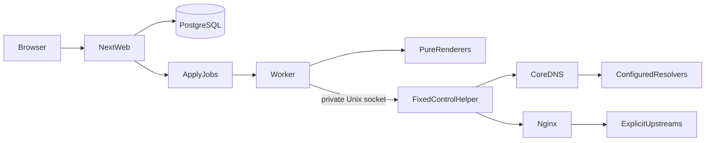
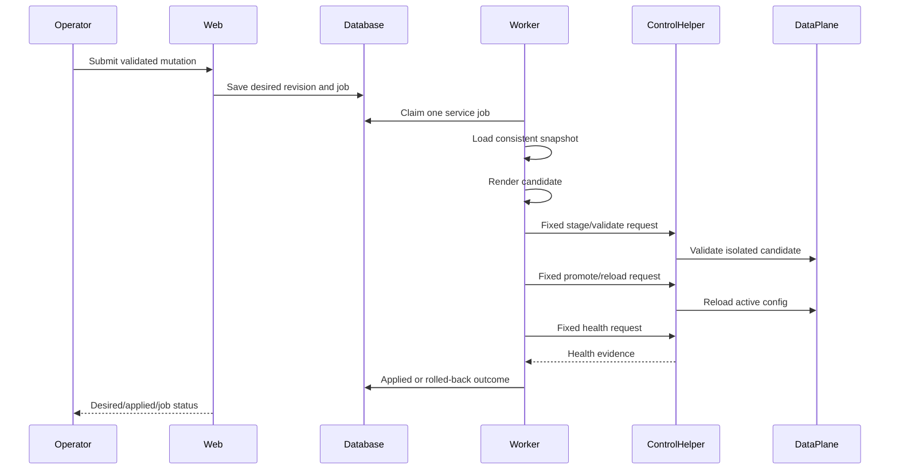
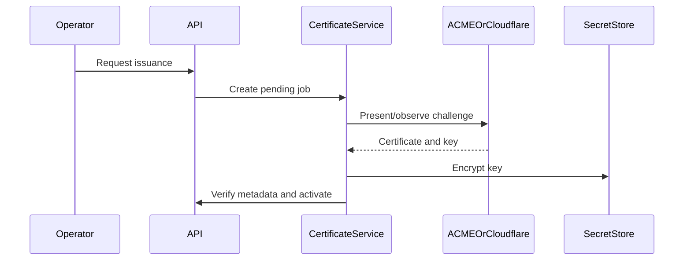

# Design: ProxyCore MVP

## Architecture

The application is a pnpm-managed TypeScript workspace with a strict
privilege/data-plane split:

The web package owns request validation, authorization, persistence commands,
and UI rendering. The worker owns snapshot orchestration and operational
state transitions. Renderers do not execute processes. The control helper owns
only the fixed service operations needed to stage, validate, promote, reload,
health-check, and roll back named services.

## Source layout

| Path | Responsibility |
| --- | --- |
| `apps/web/src/app` | Next.js pages and route handlers |
| `apps/web/src/server` | auth/session context, commands, queries, API mapping |
| `apps/worker/src` | job claiming, apply lifecycle, health, retention |
| `apps/control/src` | private socket protocol and constrained operation adapter |
| `packages/domain/src` | pure entities, invariants, policies, and ports |
| `packages/db/src` | Drizzle schema, migrations, repositories, transaction ports |
| `packages/config/src` | environment parsing and safe defaults |
| `packages/crypto/src` | password hashing, encryption, redaction |
| `packages/renderers/src` | deterministic CoreDNS and Nginx candidate renderers |
| `packages/certificates/src` | certificate model, self-signed, ACME/provider adapters |
| `packages/testing/src` | in-memory ports and deterministic fixtures |
| `infra/compose` | Compose file, Dockerfiles, service configs, volumes |
| `docs/runbooks` | operator procedures and recovery commands |

## Domain model strategy

Use typed discriminated unions for record values and policies. Validation is
performed before persistence and repeated before apply from an immutable
snapshot. A record carries the optional proxy policy directly; there is no
standalone MVP HTTP-route entity. Repositories expose ports so domain tests do
not require PostgreSQL.

The PostgreSQL schema stores:

- singleton installation settings;
- users, sessions, audit events, and encrypted secrets;
- zones, records, proxy policies, upstreams, streams, resolver pools/rules;
- certificates and provider connections;
- immutable revisions, apply jobs, health observations, and operational
  artifacts.

## Apply lifecycle

The helper protocol is JSON-lines over a Unix socket. Every request has a
correlation id, service, revision, operation, and candidate checksum. It has no
field for arbitrary commands. The control implementation maps each operation
to fixed executable/configuration paths.

## Authentication flow

Sessions use an opaque random token in a Secure/HttpOnly cookie. Only a
cryptographic digest is persisted. Every request loads the session and user,
checks revocation/expiry and role, and writes an audit event for denied
mutations. The last active Owner invariant is enforced transactionally.

## Certificate flow

Certificate issuance is a job-level port:

Fake adapters are deterministic and used in normal TDD. Real adapters are
configured by environment/secret references and are exercised only when
credentials and reachable domains are supplied.

## Rejected alternatives

- A single Next.js process with reload privileges was rejected because it
  violates the documented control-plane boundary.
- A top-level HTTP route entity was rejected by DEC-039; proxy configuration is
  attached to the DNS record.
- Hostname-based upstreams were rejected by FR-PROXY-001; all MVP destinations
  are literal IP/port/protocol values.
- Regex and raw Nginx directives were rejected because they make validation and
  rollback unsafe.
- A separate retention scheduler service was rejected as unnecessary for the
  one-worker MVP; cleanup is a worker operation.

## File-change forecast

### Baseline

`package.json`, `pnpm-workspace.yaml`, `tsconfig.json`, `vitest.config.ts`,
`drizzle.config.ts`, `next.config.ts`, `postcss.config.mjs`, and workspace
package manifests.

### Domain and persistence

`packages/domain/src/**`, `packages/db/src/**`, `packages/config/src/**`,
`packages/crypto/src/**`, and their tests/migrations.

### Data plane and operations

`packages/renderers/src/**`, `packages/certificates/src/**`,
`apps/worker/src/**`, `apps/control/src/**`, and service tests.

### Web and deployment

`apps/web/src/**`, `infra/compose/**`, `infra/coredns/**`,
`infra/nginx/**`, `docs/runbooks/**`, and root operational documentation.

## Security controls

- No web/worker Docker socket.
- No secret values in API, logs, audits, or non-secret candidates.
- No arbitrary shell or Nginx/CoreDNS input.
- Candidate checksum and revision are required for control operations.
- Basic Auth requires client TLS.
- HTTP/3 is rejected unless binary capability and TCP/UDP 443 publication are
  both verified.
